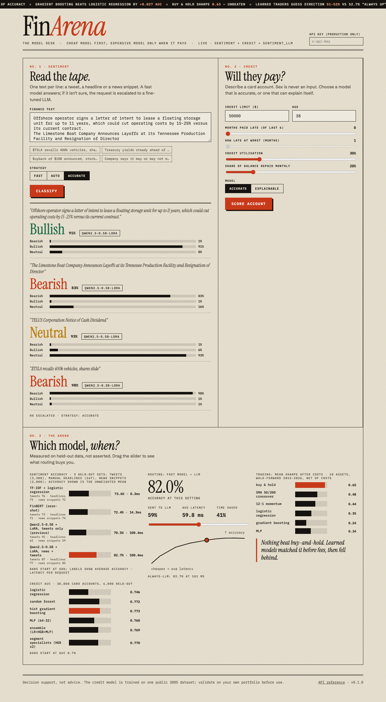

# FinArena

One authenticated API in front of several fintech models, each chosen for the job it is best at, with routing
between a cheap model and an accurate one so most requests never pay for the expensive model.

| Endpoint | What it does | Models |
|---|---|---|
| `POST /v1/sentiment` | Bearish / Bullish / Neutral for financial news text | TF-IDF + logistic regression (fast) and Qwen2.5-0.5B + LoRA (accurate), with a confidence cascade |
| `POST /v1/credit/score` | Probability of default and approve / decline | Gradient boosting (accurate) or logistic regression with plain-language reason codes (explainable) |
| `POST /v1/signature/detect` | Finds signatures in document images | YOLO11n (optional extra, see Licensing) |
| `POST /v1/analyze` | One entry point for mixed workloads: send sentiment and credit items together, each is routed to its specialist; items of one kind share a single model call and a failure affects only its own items | all of the above |
| `GET /v1/models` | Model cards with measured metrics | |
| `GET /metrics` | Prometheus metrics: requests by route and status, latency histogram, rate-limited, model-busy and escalation counters | |
| `GET /health`, `GET /ready` | Liveness and readiness | |

A browser interface is served at `/` (try the sentiment router, score a credit account, and drag the routing slider
over the measured benchmark results); API reference at `/docs`.



## Quick start

```bash
make install && make train        # trains the credit model (downloads the public dataset)
python scripts/train_sentiment.py # builds the fast sentiment model; pass an adapter dir to add the LLM
FINARENA_ENV=dev make run         # auth disabled for local use only
```

Or with Docker Compose (read-only filesystem, non-root, health check): `cp .env.example .env`, set your keys, then
`docker compose up -d --build`. See [docs/DEPLOY.md](docs/DEPLOY.md) for sizing, TLS, monitoring and rollback.

Production requires keys, otherwise the service refuses to start:

```bash
export FINARENA_API_KEYS=key-one,key-two
docker build -t finarena . && docker run -p 127.0.0.1:8000:8000 -e FINARENA_API_KEYS=$FINARENA_API_KEYS finarena
curl -H "x-api-key: key-one" -H "content-type: application/json" localhost:8000/v1/sentiment \
  -d '{"texts": ["$TSLA beats earnings, stock jumps"], "strategy": "auto"}'
```

Build with the LLM (about 3.8 GB; the base model is baked in so startup needs no network):
`docker build --build-arg EXTRAS='[llm]' --build-arg PRELOAD_LLM=1 -t finarena:llm .`
Set `FINARENA_REQUIRE_LLM=1` so the container refuses to start, rather than silently serving only the fast model, if
the LLM cannot load. `/ready` reports `sentiment_llm` either way. The trained artifacts (`artifacts/`, 39 MB, including the 35 MB
LoRA adapter) are committed, so a fresh clone builds and runs as-is; `scripts/` regenerates them. Only `signature.pt`
(AGPL-linked) is kept out of git: copy it in yourself to enable `/v1/signature/detect`.

## How routing works

`strategy: "auto"` answers with the fast model and escalates only the requests whose top-class probability is
below `FINARENA_CASCADE_THRESHOLD` (default 0.8) to the LLM. Each result reports which model answered and
whether it escalated, so cost is auditable. `fast` and `accurate` force a single model.

## Engineering

- Strict request validation (Pydantic), batch / text / image size limits, constant-time API-key check.
- Request IDs on every response, structured JSON access logs, no stack traces returned to clients.
- Models load from `artifacts/`; a missing optional model degrades that endpoint to 503, never a crash.
- Sex is not an accepted input and not a model feature. The credit service returns the cost assumption behind its
  decision threshold with every response.
- Per-client rate limiting (`429` + `Retry-After`) and a request-size cap that refuses oversized bodies before reading them.
- Tests cover the API contract, auth, validation, routing, concurrency, rate limiting and credit behaviour on the real model; lint clean (ruff); CI
  workflow runs tests and a container smoke test.

## Measured model behaviour

Numbers come from the benchmark projects that produced these models; see `artifacts/model_cards.json` for the
values the running service reports.

- **Credit:** gradient boosting test AUC 0.774 vs logistic regression 0.746 (paired bootstrap difference +0.027,
  95% CI [0.019, 0.036]) on 30,000 accounts. Adding more models or segment specialists gave no significant gain.
- **Sentiment**, accuracy on three held-out sets (full details and code in [fin-lora](https://github.com/shaikn6/fin-lora)):

  | Model | Tweets (2,388) | Manual headlines (267) | News snippets (2,000) |
  |---|---|---|---|
  | TF-IDF + logistic regression (fast tier) | 75.8% | 73.4% | 71.7% |
  | FinBERT, zero-shot | 72.5% | 71.2% | 73.6% |
  | Qwen2.5-0.5B + LoRA, tweets only (the previous version) | 90.7% | 61.8% | 59.0% |
  | **Qwen2.5-0.5B + LoRA, news + tweets (accurate tier)** | 86.6% | **76.8%** | **84.7%** |

  How to read it: the tweets-only model was excellent on tweets and poor on news, which is why the current model was
  retrained on news. The headline set is the independent test (labels written by people, never trained on), but it has
  only 267 examples, so the margin of error is about 5 points and the LoRA model's lead there is **not statistically
  proven**; it also contains just 12 negative headlines, so negative-class results are unreliable. The snippet labels
  were produced by an LLM ensemble (NOSIBLE), and the model was trained on the same kind of labels, so its 84.7% there
  overstates how it would do against human judgement. The same numbers were re-measured through this API: on the manual
  headlines the accurate path scores 76.8%, the fast path 73.4%, and `auto` 77.2% while escalating 52% of requests.
  Escalation threshold 0.8 was chosen on dev data only: on the test sets the cascade lands about 1 point from always using
  the LLM (0.4 to 1.0) while sending 52% (headlines), 56% (tweets) and 70% (news snippets) of requests to it. Latency is batch-size-1
  on Apple MPS and will differ elsewhere.

## Configuration

All settings are environment variables, read once at startup.

| Variable | Default | Meaning |
|---|---|---|
| `FINARENA_ENV` | `prod` | `prod` refuses to start without API keys; `dev` disables auth (local use only) |
| `FINARENA_API_KEYS` | none | Comma-separated keys, sent as `x-api-key: <key>` or `Authorization: Bearer <key>` |
| `FINARENA_ARTIFACT_DIR` | `artifacts` | Where model files and results are loaded from |
| `FINARENA_RATE_PER_MINUTE` | `120` | Requests per minute per client (API key, else IP) on `/v1/*`; bursts up to this size; `0` disables. Over the limit: `429` with `Retry-After`. Health, readiness and the UI are never limited. Per process. |
| `FINARENA_MAX_BATCH` | `64` | Items per request (`413` above) |
| `FINARENA_MAX_TEXT_CHARS` | `2000` | Characters per text (tweet, headline or news snippet). The LLM reads a 256-token window: longer text is trimmed, never the prompt |
| `FINARENA_MAX_IMAGE_BYTES` | `10485760` | Largest image; any request body over this plus 64 KiB is refused with `413` before it is read; POSTs without a `Content-Length` (chunked uploads) get `411` |
| `FINARENA_CASCADE_THRESHOLD` | `0.8` | Confidence below which `auto` escalates to the LLM |
| `FINARENA_ENABLE_LLM` / `FINARENA_REQUIRE_LLM` | `1` / `0` | Load the LLM; refuse to start if it cannot load |
| `FINARENA_MODEL_WAIT_SECONDS` | `20` | How long a request waits for a busy model before `503` |
| `FINARENA_ENABLE_SIGNATURE` | `0` | Enable the AGPL-linked signature endpoint |

Rate limiting keys on the API key when one is sent, otherwise on the client IP. Behind a reverse proxy the IP is the
proxy's, so either rely on API keys or start uvicorn with `--proxy-headers --forwarded-allow-ips=<proxy address>`.

## Updating the sentiment model

The model, its fast tier and the benchmarks come from [fin-lora](https://github.com/shaikn6/fin-lora). To retrain and ship a
new version:

```bash
# in fin-lora: train, evaluate, then export what the API needs
python train_news.py Qwen/Qwen2.5-0.5B-Instruct news-0.5b && python eval_news.py ... && python export_for_finarena.py
# in finarena: install it (checks everything first, then swaps atomically), refresh the arena data, run the tests
python scripts/import_sentiment.py ~/fin-lora && python scripts/build_arena.py && pytest
```

The adapter ships with a `prompt.json` (the exact prompt template and token window it was trained with) and the API
reads its prompt from there, so serving cannot drift from training. An adapter without that file refuses to load.

## Capacity (measured, one process, Apple M-series laptop, 8 concurrent clients, 60 requests each)

| Path | Throughput | p50 | p95 | Errors |
|---|---|---|---|---|
| sentiment `fast` | 480 req/s | 7 ms | 59 ms | 0 |
| sentiment `auto` (cascade) | 18 req/s | 506 ms | 1122 ms | 0 |
| sentiment `accurate` (LLM only) | 17 req/s | 448 ms | 503 ms | 0 |
| credit score | 57 req/s | 124 ms | 208 ms | 0 |

Inputs mix tweets, headlines and news-length snippets. On this mix `auto` is no faster than `accurate`: the fast model
is rarely confident about news, so most requests escalate (about 52-70% on the test sets). The cascade saves real
work on easy text such as tweets, much less on news.

In the Docker image (CPU only, 4 concurrent clients, 40 requests each, ~2.6 GB RAM): fast 429 req/s, credit 64 req/s,
auto 4.5 req/s (p50 1.3 s), accurate 3.3 req/s (p50 1.3 s), 0 errors, 0 restarts. The accurate path is about 5x
slower on CPU than on an Apple GPU.

The LLM runs one request at a time (torch on Apple's GPU aborts the process if two threads use it at once; this was
found by this very load test, which killed the first version of the server). Callers wait up to
`FINARENA_MODEL_WAIT_SECONDS` (default 20) for their turn, then receive `503` with `Retry-After: 2`. Run more
processes or replicas to scale the accurate path; `scripts/load_test.py` reproduces these numbers; run the server with `FINARENA_RATE_PER_MINUTE=0` when load testing,
otherwise the rate limit (below) will answer most of the requests with `429`.

## Limitations (read before selling or deploying)

- **Not a trading system.** Nothing here predicts markets or makes money by itself.
- The credit model is trained on one public 2005 Taiwanese dataset. Before lending decisions it must be retrained
  and validated on your own portfolio, with your own fair-lending and model-risk review (e.g. SR 11-7 / ECOA).
  Outputs are decision support, not adverse-action notices.
- Sentiment is trained on English finance tweets, press-release headlines and news snippets. Other languages are out of
  distribution, texts are trimmed to fit a 256-token window (the beginning is kept), and the model is weakest on negative news headlines (rare
  in the only human-labeled test set).
- Rate limits are per process (see Configuration) and there is no persistence; behind several replicas, also enforce limits at the gateway.

## Licensing

The core service (sentiment, credit) depends only on permissively licensed components. **The signature detector
uses `ultralytics` and a dataset that are AGPL-3.0.** Enabling it in a closed-source commercial product requires
either open-sourcing that product under AGPL-3.0 or buying an Ultralytics commercial licence. It is an optional
extra (`pip install ".[signature]"`, `FINARENA_ENABLE_SIGNATURE=1`) and is off by default.

Qwen2.5-0.5B-Instruct is Apache-2.0. Datasets: UCI credit default (CC BY 4.0); for sentiment,
`zeroshot/twitter-financial-news-sentiment` (MIT), `Jean-Baptiste/financial_news_sentiment` (MIT) and
[NOSIBLE/financial-sentiment](https://huggingface.co/datasets/NOSIBLE/financial-sentiment) (ODC-By: credit to NOSIBLE).
**Before selling the sentiment model, have counsel review the NOSIBLE data**: its labels were generated by LLMs from
several vendors (their terms may restrict training on outputs) and its text is scraped from public news sites.

## Companion projects

The models FinArena serves were built and benchmarked in their own repos, with data, tests and caveats:

- [fin-lora](https://github.com/shaikn6/fin-lora): LoRA-tuned Qwen2.5-0.5B for finance sentiment versus a TF-IDF baseline, plus the confidence cascade (sentiment endpoint)
- [credit-arena](https://github.com/shaikn6/credit-arena): credit-default model comparison with significance tests and a fair-lending audit (credit endpoint)
- [sigdet](https://github.com/shaikn6/sigdet): signature detector and robustness study (signature endpoint; see Licensing above)

Related experiments the API does not use:

- [trade-arena](https://github.com/shaikn6/trade-arena): walk-forward backtest of trading models, net of costs
- [exec-rl](https://github.com/shaikn6/exec-rl): PPO trade-execution agent (simulation only)
